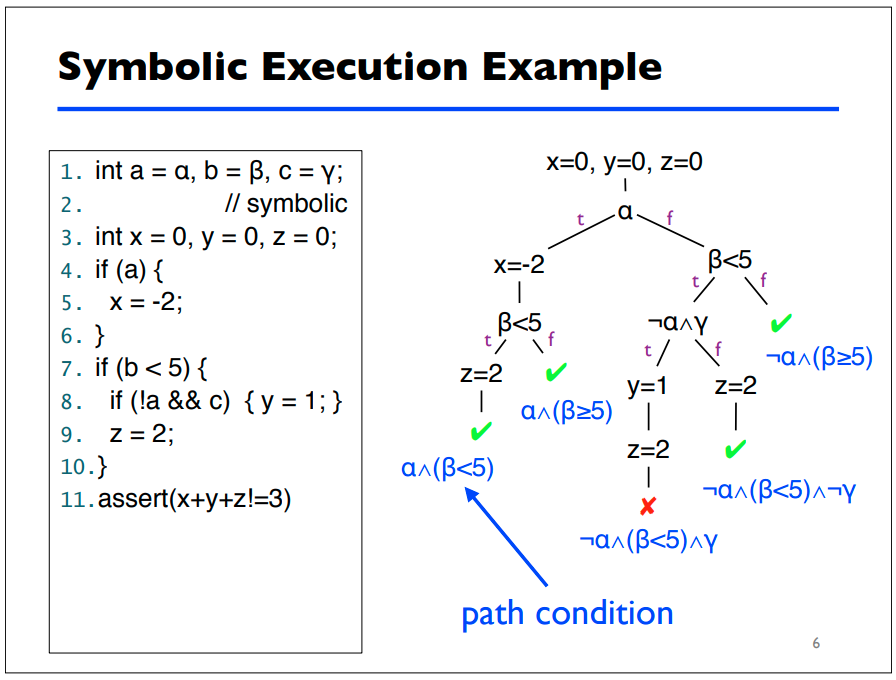

# Symbolic execution

**Symbolic execution** is a program analysis technique that can be used to
determine what concrete values are required to cause different parts of a
program to execute. It's goals are similar to code-coverage based fuzzing,
however, it's different because it's not generating and mutating a bunch of
concrete input and throwing it at the program until it reaches a new execution
path or branch.

Symbolic execution analyzes a program and assigns symbolic values to all
expressions that cause conditional branches within a program. A symbolic
execution engine maintains and generates **path conditions** using these
symbols and expressions, providing the researcher with a symbolic
representation of how to reach different execution paths within the program.

Symbolic execution engines also utilize **model checkers**, taking the
generated path conditions for each execution path and leveraging a
**satisifiability modulo theories (SMT)** solver, or constraint solver, to
calculate the concrete values that satisfy the formulas represented by each
path condition. [[1]](#references)

## Example

Here's an example from a presentation on symbolic execution from the
University of Maryland [[2]](#references):

This example provides the reader with a solid breakdown of how path conditions
are generated for different paths of execution in a small snippet of code. The
symbolic execution engine will provide to the tester what conditions need to be
true for the `assert` call to fail. From there, the engine can also derive
concrete values for each symbol that will cause the program to fail the
assertion.

## Concolic execution

Dynamic symbolic execution or **concolic execution** is a form of white-box
fuzzing that conducts symbolic execution while the program is being executed
with concrete values. Like we discussed earlier, this form of white-box fuzzing
is possible through [instrumentation](./instrumentation.md) of the PUT. The
symbolic execution engine is able to recieve feedback on the concrete input it
provides to the PUT allowing it to derive symbolic constraints for different
paths of execution more efficiently. The algorithm for concolic execution is
actually explained pretty well in the concolic testing Wikipedia article.
[[3]](#references).

## Applications

Symbolic execution is useful for software verification and testing because,
unlike static analysis tools, symbolic execution will never produce false
positives for software errors. Symbolic execution is useful for software
engineering because its final product is a concrete input that will cause the
**program under test (PUT)** to fail a specification. Various different
symbolic execution engines and tools have been used across the industry by
software engineers and hackers alike to find security vulnerabilities.

## Limitations

There are some properties of programs that can hinder program analysis using
symbolic execution. A quick listing and short description of these limitations
referencing [[1]](#references) can be found below:

* **Memory** - symbolic execution engines have a hard time handling pointers,
arrays, and other complex objects like the contents of data structures stored
on the heap.
* **Environment** - symbolic execution engines don't account for things like
calls to other libraries, file system operations, etc. A symbolic execution
engine could be testing path conditions that contain file operations for some
static filename. Unlike the tests being conducted by the engine, the state of
the file is permanent and thus, if the contents of the file are used for
conditional branches or expressions, this could cause non-deterministic
outcomes for different tests conducted by the engine.
* **Path explosion** - symbolic execution engines don't scale well when testing
large programs - the number of feasible paths in a program grows exponentially
with program size. The number of feasible paths tracked by an engine can also
become infinite given some loop exists within the program that contains an
unbounded number of iterations.

## References

1. [https://arxiv.org/pdf/1610.00502.pdf](https://arxiv.org/pdf/1610.00502.pdf)
2. [https://www.cs.umd.edu/~mwh/se-tutorial/symbolic-exec.pdf](https://www.cs.umd.edu/~mwh/se-tutorial/symbolic-exec.pdf)
3. [https://en.wikipedia.org/wiki/Concolic_testing](https://en.wikipedia.org/wiki/Concolic_testing)
